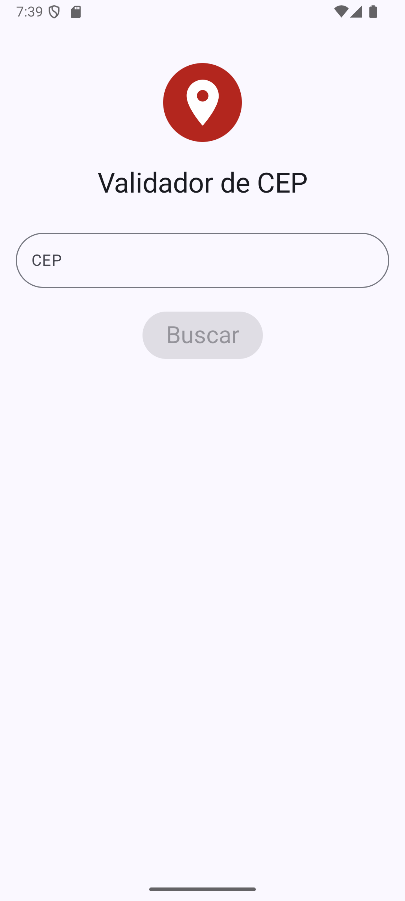
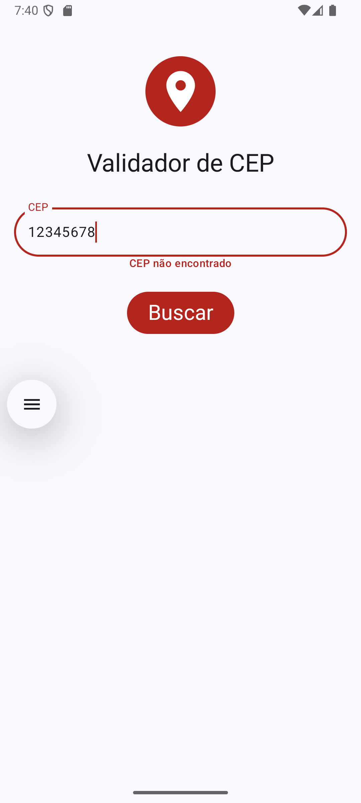
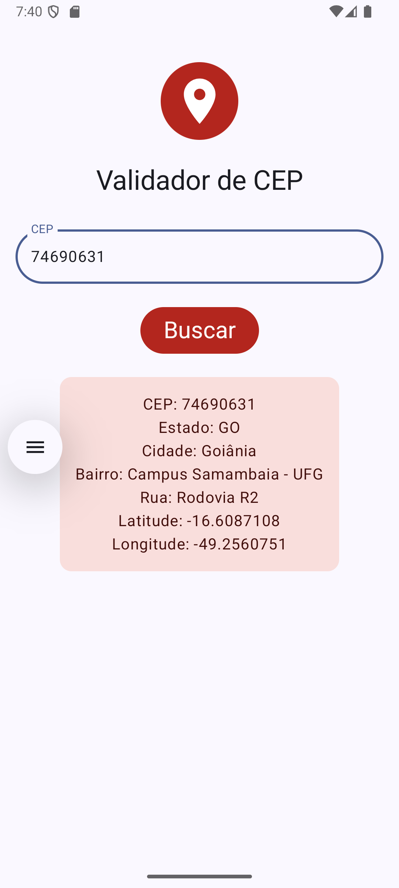

# 📍 Validador de CEP

Um aplicativo Android desenvolvido com **Jetpack Compose** que realiza buscas de endereço em tempo real a partir de um CEP.

## ✨ Funcionalidades

*   **Busca em APIs:** Consulta de endereços disparada por interação do usuário.
*   **Botão com Estado de Loading:** Transição suave entre texto e indicador de progresso usando `AnimatedContent`.
*   **Validação em Tempo Real:** Filtro de caracteres no campo de entrada e tratamento visual de erros.
*   **Exibição Dinâmica:** Card de informações que aparece apenas quando o endereço é encontrado..

## 🛠️ Tecnologias e Conceitos

*   **[Jetpack Compose](https://developer.android.com):** UI declarativa.
*   **Material Design 3:** Uso de `MaterialTheme` para cores (error, primary) e tipografia.
*   **State Management:** Gerenciamento de estado com `mutableStateOf` e `remember`.
*   **Kotlin:** Linguagem base para lógica e interface.

## 📸 Telas

  
